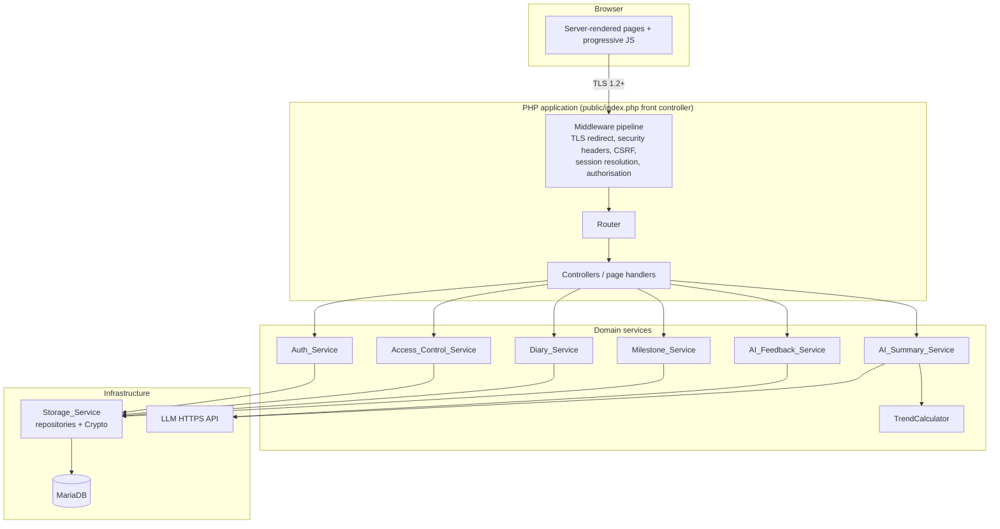
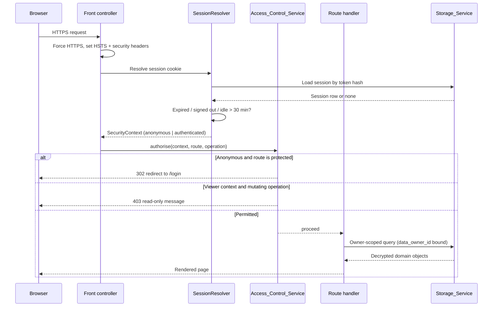
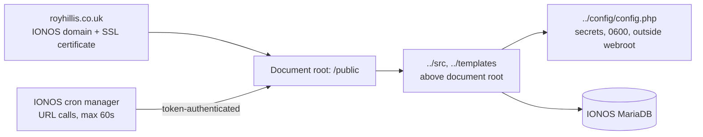
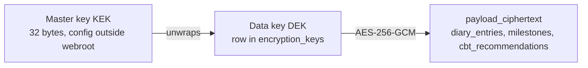
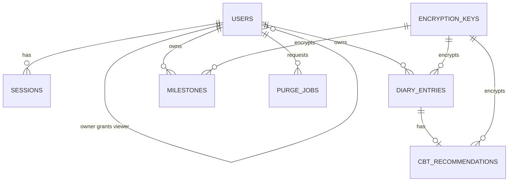

# Design Document

## Overview

The Diary_App is a small, server-rendered web application for a single Primary_User (Roy Hillis) plus a handful of read-only Viewers. It is deliberately modest in scale (one diary entry per day, a few hundred rows per year) but strict in its handling of data, because every Diary_Entry and Milestone is UK GDPR special category (health) data.

The design is shaped by three forces:

1. **Hosting constraints.** The application must run on IONOS hosting under `royhillis.co.uk`.
2. **Data sensitivity.** Special_Category_Data must be encrypted at rest with AES-256 or stronger, transmitted only over TLS 1.2+, and fully deletable.
3. **Correctness of access control.** A single mistake in role scoping exposes a person's mental health record, so authorisation is centralised and enforced on every request rather than sprinkled through templates.

### Research findings: IONOS hosting constraints

Findings that directly drove the technology choices:

- IONOS managed web hosting and [Deploy Now support static projects and PHP projects with MariaDB databases](https://ionos.com/help/hosting/deploy-now/deploy-now-supported-technologies-and-scope-of-customer-service/); Node.js runtimes are not offered on those plans and require a VPS or dedicated server. (Content was rephrased for compliance with licensing restrictions.)
- The IONOS [cron job manager schedules HTTP calls to URLs, allows up to 500 jobs per contract, and caps each run at 60 seconds](https://www.ionos.it/aiuto/hosting/cronjob/cronjob-manager-di-11-ionos/). There is no persistent worker process and no guarantee of shell access on the entry-level plans. (Content was rephrased for compliance with licensing restrictions.)
- Managed hosting gives no control over the storage layer, so disk-level encryption cannot be assumed or verified.

### Technology decisions and rationale

| Decision | Choice | Rationale |
| --- | --- | --- |
| Server language | PHP 8.2+ | The only runtime guaranteed across IONOS managed hosting plans. Avoids a VPS and the operational burden of patching one. |
| Data store | MariaDB / MySQL via PDO with prepared statements | Included with IONOS hosting. Prepared statements everywhere to eliminate injection risk. |
| Frontend | Server-rendered PHP templates, plain CSS, small amount of vanilla JS | No build step means no Node toolchain on the host and a deployable artefact that is just files. Also the most accessible baseline: the app works without JavaScript. |
| Dependencies | Composer, with `vendor/` committed to the repository | Composer may not be runnable on the host; committing `vendor/` makes deployment a file copy. |
| Encryption at rest | Application-level envelope encryption, AES-256-GCM via libsodium/OpenSSL | Shared hosting offers no verifiable disk encryption, so the application must encrypt before writing. This satisfies Requirement 4.2 independently of the host. |
| Sessions | Database-backed sessions with an opaque token in a cookie | PHP's default file sessions cannot be reliably expired or terminated server-side on shared hosting. A session table makes sign-out and the 30-minute idle timeout enforceable and testable. |
| Password hashing | `password_hash` with Argon2id (bcrypt fallback) | Salted, one-way, memory-hard. Satisfies Requirement 1.4 with no bespoke cryptography. |
| Background work | Idempotent, chunked cron endpoints called by the IONOS cron manager | Fits the 60-second per-run cap; each run does a bounded slice of work and can be re-run safely. |
| AI | Provider-agnostic adapter over an HTTPS LLM API, called synchronously with a short timeout | Keeps the LLM vendor swappable, including for a self-hosted model if the data processing agreement becomes a problem. |

**If the project later moves to an IONOS VPS**, the same layering holds; only the deployment and the cron mechanism change. Nothing in the domain layer depends on PHP-specific behaviour beyond the standard library.

### Privacy note on the AI provider

Sending diary content to a third-party LLM makes that provider a data processor for special category data. The design therefore:

- Sends only entry content and derived metrics, never the user's name, email, or account identifiers (prompts are pseudonymised).
- Records the provider and model with each stored CBT_Recommendation so the processing trail is auditable.
- Keeps a single configuration switch that disables AI features entirely; the diary remains fully usable with feedback marked unavailable.
- Requires a signed data processing agreement with the chosen provider and an entry in the record of processing activities before go-live. This is a deployment prerequisite, flagged here because it is a legal blocker rather than a code change.

## Architecture

### Layers



### Request pipeline

Every request passes through the same ordered middleware. Authorisation is never left to a controller or a template.



### The SecurityContext concept

Requirement 7.3 requires denial of writes "including when an Owner_Role user accesses data through a viewer account context". Authorisation therefore keys off the **session**, not the user record:

```
SecurityContext {
    userId:      string|null
    contextRole: 'owner' | 'viewer' | 'anonymous'   // role of the account signed in to
    dataOwnerId: string|null                        // whose data this session may read
}
```

`contextRole` is captured when the session is created and never recomputed from the user row mid-session. If Roy signs in to his mother's viewer account, that session's `contextRole` is `viewer` and every mutation is refused. This single rule collapses Requirements 3.3, 5.6, 7.3, 7.5, and 10.5 into one enforcement point.

### Deployment topology on IONOS



Repository layout:

```
public/            <- document root; index.php + assets only
  index.php
  assets/{app.css,app.js}
src/
  Http/             Router, middleware, controllers
  Auth/             Auth_Service, PasswordPolicy, SessionResolver
  Access/           Access_Control_Service, permission matrix
  Diary/            Diary_Service, DiaryEntry, validation
  Milestone/        Milestone_Service, Milestone
  Ai/               FeedbackProvider, SummaryProvider, adapters, TrendCalculator
  Storage/           repositories, Crypto, KeyRing, PurgeService
  Support/          Clock, Ulid, Result
templates/          PHP view templates
config/             config.php (untracked), config.example.php
migrations/         NNN_name.sql
tools/              migrate.php, cron endpoints wiring
tests/{Unit,Property,Integration}/
```

Design decision: `config/` sits outside the document root so a web server misconfiguration cannot serve the encryption key or database credentials. IONOS lets the domain target a subdirectory, which makes this layout possible on shared hosting.

### Transport security

- The IONOS-issued certificate terminates TLS; server configuration pins TLS 1.2 as the minimum.
- `.htaccess` plus an application-level guard redirect any plaintext HTTP request to HTTPS before any handler runs, so no application data is emitted over an insecure connection.
- `Strict-Transport-Security`, `Content-Security-Policy` (no inline script, no third-party origins), `X-Content-Type-Options`, `Referrer-Policy: no-referrer`, and `X-Frame-Options: DENY` are set on every response.
- Session cookies are `Secure`, `HttpOnly`, `SameSite=Strict`, host-only, with no expiry attribute (session cookie).

### Encryption at rest

Envelope encryption keeps key rotation possible without re-reading a plaintext master key into every row:



- Cipher: AES-256-GCM (authenticated). The record's `id` and table name form the additional authenticated data, so a ciphertext cannot be moved between rows or users.
- Each sensitive record stores `key_id`, `nonce`, and `payload_ciphertext`; the whole sensitive payload is encrypted as one JSON document rather than column by column.
- Consequence: mood and sleep values cannot be aggregated in SQL. Trends are computed in PHP after decryption. At one entry per day this is trivially cheap and it keeps the "no plaintext health data in the database" rule absolute.
- Cleartext metadata retained for lookup: row ids, `owner_id`, `entry_date` / `milestone_date`, and timestamps. This means the database reveals *that* an entry exists on a date, but nothing about its content. This tradeoff is deliberate: encrypting the date would make the calendar and range queries impossible on a shared MariaDB instance.
- Key rotation: adding a new active DEK and re-encrypting rows in chunks via a cron endpoint. Retired keys stay available for decryption until no row references them.

## Components and Interfaces

Interfaces are given in PHP-flavoured pseudocode. All services return either a domain object or a `Result` carrying a machine-readable error code plus a user-facing message; none of them throw for expected validation failures.

### Auth_Service

```php
interface AuthService {
    // Requirement 1.1-1.5
    function register(string $email, string $password): Result<UserId>;

    // Requirement 2.1-2.3
    function authenticate(string $email, string $password, DateTimeImmutable $now): Result<Session>;

    // Requirement 2.4
    function signOut(SessionId $id, DateTimeImmutable $now): void;

    // Requirement 2.5
    function resolveSession(string $token, DateTimeImmutable $now): ?SecurityContext;
}

interface PasswordPolicy {
    // Requirement 1.5: >= 12 chars, >= 1 letter, >= 1 digit
    function validate(string $password): Result<null>;
    function describe(): string;   // the message returned on rejection
}
```

Behaviour notes:

- `register` normalises the email (trim, lowercase) before the uniqueness check, so `Roy@X.com` and `roy@x.com` are one account.
- Password validation runs **before** any write, so a rejected registration leaves no row and no hash anywhere (Requirement 1.4).
- `authenticate` increments `failed_login_count` on failure; reaching 5 sets `locked_until = now + 15 minutes`. A success resets the counter and clears the lock. A locked account returns the lockout error without checking the password, and lockout responses are indistinguishable in timing from ordinary failures.
- Failure responses never reveal whether an email exists.
- `resolveSession` treats a session as valid only when `terminated_at IS NULL` and `now - last_activity_at < 30 minutes`; a valid resolution slides `last_activity_at` forward.

### Access_Control_Service

```php
interface AccessControlService {
    // Requirements 2.6, 3.3, 5.6, 7.3, 7.5, 10.5
    function authorise(SecurityContext $ctx, Operation $op): Decision;

    // Requirement 4.4, 8.5 - the only sanctioned source of owner scoping
    function resolveDataOwner(SecurityContext $ctx): OwnerId;

    // Requirement 7.1, 7.5
    function createViewer(SecurityContext $ctx, string $email): Result<UserId>;

    // Requirement 7.4, 7.5
    function revokeViewer(SecurityContext $ctx, UserId $viewerId): Result<null>;

    // Requirement 3.2, 3.3
    function navigationFor(SecurityContext $ctx): NavigationItem[];
}
```

The permission matrix is a single declarative table, which is what the property tests exercise:

| Operation kind | anonymous | viewer context | owner context |
| --- | --- | --- | --- |
| View login / register | allow | allow | allow |
| Read entries, recommendations, milestones, calendar, summary | redirect to login | allow (owner's data only) | allow |
| Create / update / delete Diary_Entry | redirect to login | **deny, read-only message** | allow |
| Create / update / delete Milestone | redirect to login | **deny, read-only message** | allow |
| Create / revoke Viewer, delete account | redirect to login | **deny, read-only message** | allow |

`createViewer` generates a single-use invitation token; the Viewer sets their own password, which must satisfy the same policy. Revocation sets `status = 'revoked'` and terminates that Viewer's live sessions immediately, so access ends on revocation rather than at next sign-in.

### Diary_Service

```php
interface DiaryService {
    // Requirement 5.1
    function questionSet(): QuestionDefinition[];

    // Requirements 5.2-5.6
    function submitEntry(SecurityContext $ctx, DiaryEntryInput $input): Result<DiaryEntry>;

    // Requirements 8.2, 8.4
    function entryForDate(SecurityContext $ctx, LocalDate $date): ?EntryWithRecommendation;

    // Requirements 8.1, 8.3, 8.5
    function calendarMonth(SecurityContext $ctx, YearMonth $month): CalendarMonth;

    // Requirement 9.1
    function entriesInRange(SecurityContext $ctx, DateRange $range): DiaryEntry[];
}
```

- The structured question set (Requirement 5.1) is data, not markup: mood rating (1-10, required), sleep quality (1-5 ordinal, optional), notable events, thoughts, emotions. Defining it once means the form, validation, and AI prompt cannot drift apart.
- **Design decision — sleep quality scale.** The requirements do not fix a scale. A 1-5 ordinal scale (very poor to very good) is used, because it yields a numeric series for trend metrics (Requirement 9.2) while being quicker to answer than a second 1-10 slider.
- `submitEntry` validates, then performs an upsert keyed on `(owner_id, entry_date)` inside a transaction, so a second submission for a date updates rather than duplicates (Requirement 5.4).
- A rejected submission performs no write at all, including no partial CBT_Recommendation row (Requirement 5.5).

### AI_Feedback_Service and AI_Summary_Service

```php
interface FeedbackProvider {                    // adapter over the LLM HTTPS API
    function generate(EntryContent $content): CbtRecommendation;   // throws ProviderError
}

interface AiFeedbackService {
    // Requirements 6.1-6.5
    function generateForEntry(DiaryEntry $entry): FeedbackOutcome;  // Generated | Unavailable
}

interface TrendCalculator {
    // Requirement 9.2 - deterministic, no LLM involved
    function compute(DiaryEntry[] $entries): TrendMetrics;
}

interface SummaryProvider {
    function generate(SummaryInput $input): ProgressSummary;        // throws ProviderError
}

interface AiSummaryService {
    // Requirements 9.1-9.5
    function summarise(SecurityContext $ctx, DateRange $range): SummaryOutcome;
    // SummaryOutcome = Summary | InsufficientData | Unavailable
}
```

Design decisions:

- **Trend metrics are computed in code, not by the LLM.** `TrendCalculator` produces mood and sleep counts, means, minima, maxima, and a direction derived from a least-squares slope over the series. Those numbers are then handed to the LLM as facts to narrate. This makes Requirement 9.2 deterministic and unit-testable, and it stops the model inventing statistics.
- **Outcome precedence is explicit.** `summarise` checks the entry count first: fewer than three entries always yields `InsufficientData`, even if the provider would also have failed (Requirement 9.4). Only with three or more entries does a provider failure surface as `Unavailable` (Requirement 9.5).
- **Feedback failure never blocks the diary.** `generateForEntry` runs after the entry has been committed. On provider error, timeout, or a response failing shape validation, it records `status = 'failed'` and returns `Unavailable`, and the page shows the entry with a "feedback temporarily unavailable" notice (Requirement 6.5). A retry control re-invokes the provider.
- **Response shape is validated, not trusted.** A CBT_Recommendation is accepted only if it carries exactly one non-empty positive focus and one non-empty suggested change (Requirements 6.2, 6.3). The provider is asked for strict JSON; anything else counts as a failure.
- **Prompts are pseudonymised and bounded**: content only, no identifiers, with a 20-second timeout and one retry.
- The medical disclaimer is rendered by a shared view partial used by every AI surface, so it cannot be omitted from one page (Requirements 6.6, 9.6). For the summary page it renders whenever the service is invoked, regardless of outcome.

### Milestone_Service

```php
interface MilestoneService {
    // Requirements 10.1, 10.2, 10.4, 10.5
    function create(SecurityContext $ctx, MilestoneInput $input): Result<Milestone>;
    // Requirements 10.3, 10.5
    function update(SecurityContext $ctx, MilestoneId $id, MilestoneInput $input): Result<Milestone>;
    function delete(SecurityContext $ctx, MilestoneId $id): Result<null>;
    // Requirements 8.3, 9.3
    function inRange(SecurityContext $ctx, DateRange $range): Milestone[];
}
```

Categories are a closed set: `medication`, `relationship`, `lifestyle`, `other` (Requirement 10.2). Validation rejects a missing description or date and names the offending field (Requirement 10.4).

### Storage_Service

```php
interface Crypto {
    function encrypt(string $plaintext, string $aad): Envelope;   // AES-256-GCM
    function decrypt(Envelope $envelope, string $aad): string;
}

interface DiaryEntryRepository {
    function upsert(OwnerId $owner, LocalDate $date, EntryContent $content): DiaryEntry;
    function findByDate(OwnerId $owner, LocalDate $date): ?DiaryEntry;
    function findInRange(OwnerId $owner, DateRange $range): DiaryEntry[];
    function datesWithEntries(OwnerId $owner, YearMonth $month): LocalDate[];
}

interface PurgeService {
    // Requirement 4.5
    function requestDeletion(SecurityContext $ctx): Result<null>;
    function runPurgeSlice(int $limit): PurgeReport;   // cron-safe, <60s, idempotent
}
```

- Every repository method takes an `OwnerId` resolved by `Access_Control_Service`; no repository method can be called without a scope. Owner scoping is a bound SQL parameter on every query, never string interpolation.
- **Deletion (Requirement 4.5).** A confirmed deletion request purges immediately in a single transaction: recommendations, entries, milestones, viewer accounts linked to the owner, sessions, then the user row. Audit rows are retained but stripped of any reference to deleted content. Immediate deletion is chosen over a grace period because 30 days is an upper bound, and holding health data longer than necessary is the risk the requirement exists to prevent. If any step fails, a `purge_jobs` row remains and the daily cron slice retries it, keeping the 30-day guarantee even under repeated failure.

### Cron endpoints

| Endpoint | Schedule | Bounded work |
| --- | --- | --- |
| `/cron/purge` | daily | Retry outstanding `purge_jobs`, up to N users per run |
| `/cron/sessions` | hourly | Delete sessions terminated or idle beyond retention |
| `/cron/keys` | on demand | Re-encrypt a slice of rows onto the current DEK |

Each endpoint requires a shared secret token compared with a constant-time function, refuses non-local callers where possible, is idempotent, and self-limits well inside the 60-second cap.

## Data Models



### users

| Column | Type | Notes |
| --- | --- | --- |
| `id` | CHAR(26) PK | ULID |
| `email_normalized` | VARCHAR(255) UNIQUE | trimmed, lowercased; basis of Requirement 1.2 |
| `email_display` | VARCHAR(255) | as typed |
| `password_hash` | VARCHAR(255) NULL | Argon2id; NULL until an invited Viewer sets a password |
| `role` | ENUM('owner','viewer') | Owner_Role / Viewer_Role |
| `data_owner_id` | CHAR(26) FK users.id | self for an owner, the owner for a viewer (Requirement 7.1) |
| `status` | ENUM('invited','active','revoked') | revoked ends viewer access (Requirement 7.4) |
| `failed_login_count` | TINYINT UNSIGNED | consecutive failures (Requirement 2.3) |
| `locked_until` | DATETIME NULL | lock expiry |
| `deletion_requested_at` | DATETIME NULL | starts the 30-day clock (Requirement 4.5) |
| `created_at`, `updated_at` | DATETIME | |

### sessions

| Column | Type | Notes |
| --- | --- | --- |
| `id` | CHAR(64) PK | SHA-256 of the 256-bit cookie token; the raw token is never stored |
| `user_id` | CHAR(26) FK | |
| `context_role` | ENUM('owner','viewer') | frozen at sign-in (Requirement 7.3) |
| `data_owner_id` | CHAR(26) | scope for every read in this session |
| `created_at`, `last_activity_at` | DATETIME | idle timeout basis (Requirement 2.5) |
| `terminated_at` | DATETIME NULL | set on sign-out, revocation, or password change (Requirement 2.4) |

### diary_entries

| Column | Type | Notes |
| --- | --- | --- |
| `id` | CHAR(26) PK | |
| `owner_id` | CHAR(26) FK users.id | |
| `entry_date` | DATE | UNIQUE with `owner_id` (Requirement 5.4) |
| `key_id` | CHAR(26) FK encryption_keys.id | |
| `nonce` | BINARY(12) | |
| `payload_ciphertext` | BLOB | AES-256-GCM over the JSON payload below |
| `created_at`, `updated_at` | DATETIME | |

Encrypted payload:

```json
{
  "mood_rating": 7,
  "sleep_quality": 3,
  "events": "free text",
  "thoughts": "free text",
  "emotions": "free text",
  "schema_version": 1
}
```

`mood_rating` is a required integer 1-10 (Requirement 5.2); `sleep_quality` is an optional integer 1-5.

### cbt_recommendations

| Column | Type | Notes |
| --- | --- | --- |
| `id` | CHAR(26) PK | |
| `entry_id` | CHAR(26) FK, UNIQUE | one recommendation per entry (Requirement 6.4) |
| `status` | ENUM('generated','failed') | `failed` supports retry (Requirement 6.5) |
| `key_id`, `nonce`, `payload_ciphertext` | as above, nullable when `failed` | |
| `provider`, `model` | VARCHAR(100) NULL | processing trail |
| `attempt_count` | TINYINT UNSIGNED | |
| `generated_at` | DATETIME NULL | |

Encrypted payload: `{ "positive_focus": "...", "suggested_change": "...", "schema_version": 1 }` (Requirements 6.2, 6.3).

### milestones

| Column | Type | Notes |
| --- | --- | --- |
| `id` | CHAR(26) PK | |
| `owner_id` | CHAR(26) FK users.id | |
| `milestone_date` | DATE, indexed | calendar and range lookups (Requirements 8.3, 9.3) |
| `key_id`, `nonce`, `payload_ciphertext` | encrypted | |
| `created_at`, `updated_at` | DATETIME | |

Encrypted payload: `{ "description": "...", "category": "medication|relationship|lifestyle|other", "schema_version": 1 }`. The category is encrypted because "medication" is itself health information.

### encryption_keys

| Column | Type | Notes |
| --- | --- | --- |
| `id` | CHAR(26) PK | referenced by every encrypted row |
| `wrapped_dek` | BLOB | DEK sealed with the master key from config |
| `wrap_nonce` | BINARY(12) | |
| `created_at` | DATETIME | newest non-retired key is the active one |
| `retired_at` | DATETIME NULL | retained for decryption only |

### purge_jobs

| Column | Type | Notes |
| --- | --- | --- |
| `id` | CHAR(26) PK | |
| `user_id` | CHAR(26) | no FK; the user row is deleted first |
| `requested_at` | DATETIME | 30-day deadline anchor |
| `completed_at` | DATETIME NULL | |
| `attempt_count`, `last_error` | | retry bookkeeping |

### audit_log

`id`, `actor_user_id`, `context_role`, `action`, `target_type`, `target_id`, `outcome`, `ip_hash`, `occurred_at`. Records sign-ins, lockouts, denied operations, viewer grants and revocations, and deletions. It never stores diary or milestone content, so it needs no encryption and can survive a purge in de-identified form.

### In-memory value objects

```
DiaryEntryInput  { date, moodRating, sleepQuality?, events?, thoughts?, emotions? }
MilestoneInput   { date, description, category }
TrendMetrics     { entryCount, mood: SeriesStats, sleep: SeriesStats }
SeriesStats      { count, mean, min, max, direction: improving|declining|stable }
SummaryInput     { range, metrics, entries[], milestones[] }
CalendarMonth    { month, entryDates: Set<LocalDate>, milestoneDates: Set<LocalDate> }
FeedbackOutcome  = Generated(CbtRecommendation) | Unavailable(reason)
SummaryOutcome   = Summary(text, metrics) | InsufficientData | Unavailable(reason)
```

## Correctness Properties

*A property is a characteristic or behavior that should hold true across all valid executions of a system-essentially, a formal statement about what the system should do. Properties serve as the bridge between human-readable specifications and machine-verifiable correctness guarantees.*

This feature suits property-based testing well: the security-critical parts (password policy, lockout counting, session expiry, role scoping, encryption, upsert-by-date, calendar derivation, trend metrics, summary precedence) are pure or near-pure functions over large input spaces, and they are exactly the places where a hand-picked example passes while a boundary case leaks health data.

Several acceptance criteria are deliberately not expressed as properties: TLS version negotiation (Requirement 4.3) is hosting configuration verified by a smoke check, the fixed banner text and question set (Requirements 3.1, 5.1) are single examples, and the judgement that a suggested change is "small and meaningful" (Requirement 6.3) is reviewed by a human rather than asserted.

### Property 1: Password policy is exactly as specified

*For any* string, the password policy accepts it if and only if it is at least 12 characters long and contains at least one letter and at least one digit; when it is rejected the response describes the policy and no account is created.

**Validates: Requirements 1.3, 1.5**

### Property 2: Valid registration creates an Owner_Role account

*For any* valid email address and any policy-compliant password, registration creates exactly one account holding the Owner_Role whose data owner is itself, retrievable by the normalised form of that email.

**Validates: Requirements 1.1**

### Property 3: Email uniqueness is case- and whitespace-insensitive

*For any* registered email address and any variation of it differing only in letter case or surrounding whitespace, a second registration is rejected with the already-registered message, exactly one account remains, and the existing account's stored credentials are unchanged.

**Validates: Requirements 1.2**

### Property 4: Passwords are stored only as salted one-way hashes

*For any* policy-compliant password, the stored credential verifies against that password, is not equal to it, does not contain it as a substring, and differs between two accounts that chose the same password; and *for any* rejected registration, no credential is stored at all.

**Validates: Requirements 1.4**

### Property 5: Authentication outcome follows credential validity

*For any* account, authenticating with its correct password establishes exactly one session whose context role and data owner equal that account's role and data owner, and authenticating with any non-matching password or any unregistered email establishes no session and returns the same incorrect-credentials message.

**Validates: Requirements 2.1, 2.2**

### Property 6: Lockout after five consecutive failures lasts fifteen minutes

*For any* sequence of authentication attempts against one account, the account is locked exactly when five consecutive failures have occurred since the last success or lock expiry, remains locked until exactly fifteen minutes after the fifth failure, and a successful authentication resets the consecutive-failure count to zero.

**Validates: Requirements 2.3**

### Property 7: A session is valid only while it is neither signed out nor idle for thirty minutes

*For any* session and any sequence of idle intervals, the session resolves to an authenticated context if and only if it has not been signed out and no interval since its last activity has reached thirty minutes; each successful resolution moves the idle window forward, and after sign-out the same token never resolves again.

**Validates: Requirements 2.4, 2.5**

### Property 8: Unauthenticated requests are redirected to login

*For any* request path, an unauthenticated request is redirected to the login page unless the path is the login page or the registration page.

**Validates: Requirements 2.6**

### Property 9: A viewer context can never change stored state

*For any* mutating operation (creating, updating or deleting a Diary_Entry, Milestone, Viewer account, or account) and *for any* session whose context role is Viewer -- including a session belonging to an Owner_Role user who signed in to a viewer account -- the operation is denied with the read-only message and a snapshot of all stored data is identical before and after the request.

**Validates: Requirements 3.3, 5.6, 7.3, 7.5, 10.5**

### Property 10: Navigation reflects the session's context role

*For any* authenticated session, the rendered navigation contains exactly the controls permitted for that session's context role by the permission matrix, and contains no diary-entry or milestone creation control when the context role is Viewer.

**Validates: Requirements 3.2**

### Property 11: Special category data is never stored in plaintext

*For any* Diary_Entry content and *for any* Milestone content, persisting then reading it back yields the original values, the raw stored bytes contain none of those plaintext values, the cipher used is AES-256-GCM, and any modification of the ciphertext, nonce, or record binding causes a decryption failure rather than returning altered data.

**Validates: Requirements 4.1, 4.2**

### Property 12: Reads are scoped to the session's data owner

*For any* set of Primary_Users with entries, recommendations and milestones, and *for any* set of viewers linked to them, every read operation returns only data belonging to the requesting session's resolved data owner; active viewers receive that owner's entries, recommendations, milestones, calendar and summary, and revoked viewers receive nothing.

**Validates: Requirements 4.4, 7.2, 8.5**

### Property 13: Account deletion removes every trace of the account's data

*For any* account and any dataset of entries, recommendations, milestones, viewer accounts and sessions belonging to it, completing the deletion process leaves no row in any table referencing that account or its content, leaves every other account's data unchanged, and re-running the deletion process changes nothing further.

**Validates: Requirements 4.5**

### Property 14: Mood rating validation gates every write

*For any* diary submission, it is accepted if and only if the mood rating is an integer from 1 to 10 inclusive; a rejected submission leaves all stored data unchanged (including any pre-existing entry for that date) and returns a message identifying the mood rating field.

**Validates: Requirements 5.2, 5.5**

### Property 15: Exactly one entry per date, holding the last accepted submission

*For any* sequence of accepted diary submissions for a single owner and date, exactly one Diary_Entry exists for that owner and date, its content equals the last submission in the sequence, and retrieving that date returns that entry together with its own associated CBT_Recommendation and no other entry's recommendation.

**Validates: Requirements 5.3, 5.4, 6.4, 8.2**

### Property 16: Feedback generation is driven by the entry's own content

*For any* submitted Diary_Entry, the content passed to the feedback provider consists of exactly that entry's structured answers and contains no account identifier, email address or user name, and a recommendation record linked to that entry exists afterwards regardless of the provider's outcome.

**Validates: Requirements 6.1**

### Property 17: A recommendation is accepted only with one positive focus and one suggested change

*For any* provider response, it is accepted as a CBT_Recommendation if and only if it contains exactly one non-empty positive focus and exactly one non-empty suggested change; every other response is treated as a generation failure, and every stored recommendation therefore carries both fields non-empty.

**Validates: Requirements 6.2, 6.3**

### Property 18: Feedback failure never costs the entry

*For any* Diary_Entry and *for any* feedback provider failure mode (error, timeout, malformed response, or response failing shape validation), the entry remains stored and retrievable with its submitted content, and the entry view reports that feedback is temporarily unavailable.

**Validates: Requirements 6.5**

### Property 19: Every AI surface carries the medical disclaimer

*For any* view that displays AI-generated output or invokes an AI service, and *for any* outcome of that service (generated, failed, or insufficient data), the rendered output contains the notice stating the content is automated and is not a substitute for professional medical advice.

**Validates: Requirements 6.6, 9.6**

### Property 20: Granting and revoking viewer access are inverses

*For any* valid email address, creating a Viewer account from an Owner_Role session produces an account with the Viewer_Role whose data owner is that Primary_User and which can read that Primary_User's data once activated; revoking it denies every subsequent read, stops any live session of that viewer from resolving, and prevents re-authentication.

**Validates: Requirements 7.1, 7.4**

### Property 21: Calendar indicators match stored data exactly

*For any* set of Diary_Entry and Milestone records across multiple owners and months, and *for any* displayed month, the calendar's entry-indicator dates equal exactly the requesting session's data owner's entry dates within that month, its milestone-indicator dates equal exactly that owner's milestone dates within that month, and selecting any date in that month without an entry yields the no-entry message.

**Validates: Requirements 8.1, 8.3, 8.4, 8.5**

### Property 22: Summary input contains exactly the in-range data

*For any* date range and *for any* set of entries and milestones across multiple owners, the data supplied for summary generation consists of exactly the requesting session's data owner's Diary_Entry and Milestone records whose dates fall within the inclusive range, and nothing outside it.

**Validates: Requirements 9.1, 9.3**

### Property 23: Trend metrics equal a reference computation

*For any* series of Diary_Entry records in a date range, including series with missing sleep-quality values, the computed mood and sleep trend metrics equal the reference count, mean, minimum, maximum and direction for that series, and both metric sets appear in the rendered summary.

**Validates: Requirements 9.2**

### Property 24: Summary outcome follows the decision table, with insufficient data taking precedence

*For any* combination of in-range entry count and summary provider outcome, the summary view state is: the more-entries-needed message when fewer than three entries exist, whether or not generation also fails; the temporarily-unavailable message when three or more entries exist and generation fails; and the generated summary otherwise.

**Validates: Requirements 9.4, 9.5**

### Property 25: Milestone operations match an in-memory model

*For any* sequence of valid create, update and delete operations issued from an Owner_Role session, the stored set of Milestones equals the set produced by applying the same sequence to a simple in-memory model: created milestones are retrievable with identical description, date and category, updated milestones reflect the last write, and deleted milestones are absent.

**Validates: Requirements 10.1, 10.2, 10.3**

### Property 26: Invalid milestone input is rejected without writing

*For any* milestone input whose description is absent or blank, whose date is absent, or whose category is outside the permitted set, the submission is rejected, all stored data is unchanged, and the returned message identifies each offending field.

**Validates: Requirements 10.4**

## Error Handling

### Principles

- **Fail closed.** Any error inside the authorisation pipeline results in denial, never a fallthrough to the handler. An unresolvable session is treated as anonymous.
- **Validate before writing.** Every service validates its whole input before touching the database, and every multi-row change runs in a transaction, so a rejected or failed operation leaves no partial state. This is what Properties 14 and 26 assert.
- **Two-audience messaging.** Users get a short, plain, non-technical message. Detail goes to a server-side log with a correlation id shown to the user. Stack traces, SQL, and provider payloads are never rendered.
- **No health data in logs.** Logs record identifiers, actions and outcomes only. Decrypted content is never written to a log, an error page, or an exception message.
- **Non-enumeration.** Authentication and lookup failures use uniform messages and comparable response times so they cannot be used to discover which email addresses exist.

### Error catalogue

| Condition | Requirement | Handling | User sees |
| --- | --- | --- | --- |
| Password fails policy | 1.3, 1.5 | Reject before any write | The policy description, form values preserved except the password |
| Email already registered | 1.2 | Reject, no change to existing account | "That email address is already registered" |
| Wrong credentials | 2.2 | Increment counter, log attempt | "Your email address or password is incorrect" |
| Account locked | 2.3 | Refuse without checking the password | "Too many failed attempts. Try again in 15 minutes" |
| Session idle or signed out | 2.4, 2.5 | Terminate session, clear cookie, redirect | "Your session ended. Please sign in again" |
| Anonymous access to protected route | 2.6 | Redirect to login, preserving intended path | Login page |
| Mutation attempted in viewer context | 3.3, 7.3 | 403, log the denial, no write | "This account has read-only access" |
| Mood rating missing or out of range | 5.2, 5.5 | Reject whole submission, keep any existing entry | "Please give a mood rating from 1 to 10", answers preserved |
| Milestone missing description or date | 10.4 | Reject, no write | Message naming each missing field |
| Feedback provider error or timeout | 6.5 | Commit entry, record `status=failed`, offer retry | Entry, plus "Feedback is temporarily unavailable" |
| Provider returns malformed or incomplete output | 6.2, 6.3, 6.5 | Treat as failure, do not store partial output | Same as above |
| Fewer than 3 entries in range | 9.4 | Return `InsufficientData` before calling the provider | "More entries are needed to produce a reliable summary" |
| Summary provider fails with 3+ entries | 9.5 | Return `Unavailable`; deterministic trend metrics still shown | "The summary is temporarily unavailable" |
| Decryption or authentication tag failure | 4.2 | Do not render the record; log with the record id; raise an integrity alert | "This entry could not be read. Please contact support" |
| Database unavailable | - | Generic error page, no schema detail | "Something went wrong. Please try again shortly" |
| Purge step fails | 4.5 | Leave the `purge_jobs` row for the daily cron to retry until the 30-day deadline | Deletion confirmed; failure is invisible to the user and alerted internally |
| CSRF token missing or stale | - | Reject the request, no write | "That form expired. Please try again" |

### Failure isolation for AI

AI calls sit outside the transaction that persists user data. The diary is fully usable with the AI provider down: entries save, the calendar works, and the summary page still shows deterministic trend metrics with the narrative marked unavailable. A configuration switch disables AI entirely without disabling the diary.

## Testing Strategy

### Layers

| Layer | Tool | Scope |
| --- | --- | --- |
| Unit | PHPUnit | Specific examples, fixed page content, error messages, single edge cases |
| Property | PHPUnit + [Eris](https://github.com/giorgiosironi/eris) | The 26 correctness properties above |
| Integration | PHPUnit against a real MariaDB test schema | Repository SQL, transactions, purge, cron endpoints, middleware ordering |
| Smoke / deployment | Script run against the deployed site | TLS 1.2+ negotiation, HSTS, security headers, HTTP-to-HTTPS redirect |

### Property test rules

- The library is Eris, chosen because it integrates with PHPUnit and is the established property-based testing tool in the PHP ecosystem. Property-based testing is not implemented from scratch.
- Each correctness property is implemented by exactly **one** property-based test.
- Each property test runs a minimum of **100 iterations** (`$this->limitTo(100)`).
- Each property test carries a comment tag in this form:

  ```php
  // Feature: mental-health-diary, Property 15: Exactly one entry per date, holding the last accepted submission
  ```

- Time is injected through a `Clock` interface so Properties 6 and 7 can generate arbitrary elapsed intervals without sleeping.
- AI providers are stubbed through the `FeedbackProvider` and `SummaryProvider` interfaces. Stubs record their inputs (Properties 16, 22) and can be told to fail in a generated failure mode (Properties 18, 24). No property test makes a network call.
- Generators are shared and deliberately hostile: unicode and emoji text, empty and whitespace-only strings, very long strings, mood values inside and outside 1-10, non-integer mood values, leap days, month and year boundaries, date ranges that are inverted or zero-length, multiple owners with overlapping dates, and viewer sessions belonging to Owner_Role users.
- State-changing properties (9, 13, 14, 26) assert against a full snapshot of the database rather than a single table, so an unexpected write anywhere is caught.

### Unit and integration tests

Unit tests stay deliberately few, since the properties cover input breadth. They cover:

- The home page banner text (Requirement 3.1) and the structured question set (Requirement 5.1).
- The exact wording of each user-facing message in the error catalogue.
- Prompt construction snapshots, so a prompt change is a visible diff and cannot silently start including identifiers.

Integration tests cover what properties cannot:

- Middleware ordering: TLS redirect, then security headers, then session resolution, then authorisation, then handler.
- The unique index on `(owner_id, entry_date)` genuinely prevents duplicates under concurrent submission.
- Cron endpoints reject a missing or wrong token, are idempotent, and complete a slice well inside the 60-second IONOS cap.
- Migrations apply to an empty schema and are re-runnable.
- End-to-end journeys with a stubbed provider: register, sign in, submit an entry, view feedback, add a milestone, browse the calendar, generate a summary, invite and revoke a viewer, delete the account.

### Manual and deployment verification

- One live end-to-end check against the real AI provider per release, reviewing that the recommendation reads as CBT-appropriate guidance with a single positive focus and one small change (the qualitative half of Requirements 6.2 and 6.3).
- Keyboard-only and screen-reader pass over the entry form and calendar. Full WCAG conformance needs manual testing with assistive technologies and an expert accessibility review; automated checks alone cannot confirm it.
- Confirm before go-live: the master key exists only in `config/config.php` outside the document root with restrictive permissions, TLS is enforced, a data processing agreement with the AI provider is signed, and a restore from backup has been rehearsed (backups hold ciphertext, so the key must be recoverable independently).
