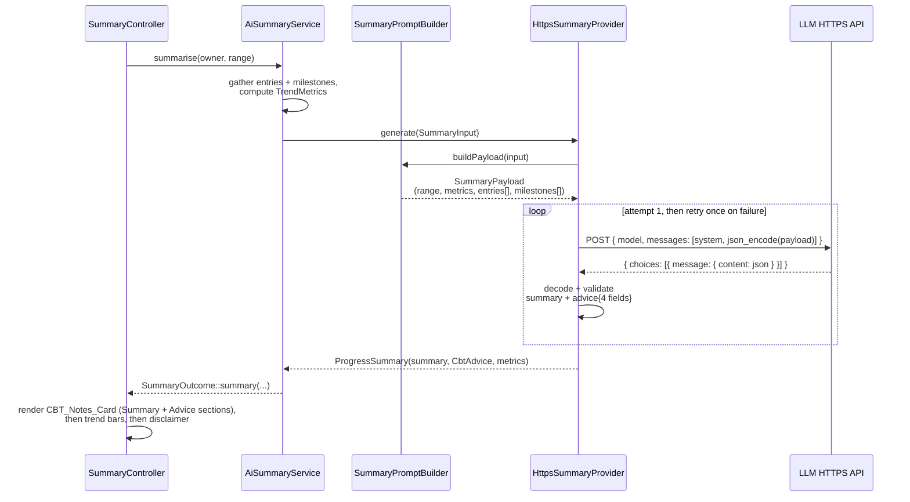

# Design Document

## Overview

This design covers three related changes to the existing progress-summary feature (`AiSummaryService::summarise()`, `HttpsSummaryProvider`, `SummaryPromptBuilder`, and the summary page rendered by `SummaryController`):

1. **Structured JSON payload.** `SummaryPromptBuilder` stops building a free-text prompt and instead builds a `SummaryPayload` - a JSON-serializable object carrying the date range, the computed `TrendMetrics`, and date-ordered lists of `SummaryEntryRecord`s and `SummaryMilestoneRecord`s (in practice, the JSON serialization of the existing `SummaryEntryContent` / `SummaryMilestoneContent` classes). `HttpsSummaryProvider` sends this payload's JSON encoding as the entirety of the user message content.
2. **Two-section AI response contract.** The response contract grows from `{"narrative": "..."}` to `{"summary": "...", "advice": {"pattern": "...", "distortions": "...", "balanced_perspective": "...", "next_action": "..."}}`. `ProgressSummary` grows a `CbtAdvice` value object alongside its existing narrative and metrics. `HttpsSummaryProvider`'s parsing/validation and retry-once-then-fail logic are extended to cover all five string fields instead of one.
3. **Trend line chart and shared axis.** `SummaryController`'s trend visualisation is replaced with a server-rendered inline SVG line chart (`renderLineChart()`) plotting each series' dated `TrendPoint`s over time, styled with the app's existing design tokens, and positioned via a `SharedTrendAxis` helper that maps both the mood and sleep charts' plotted values against a common 0-10 scale, while the rendered numeric labels keep showing each metric's true native-scale value with a scale suffix (`/10` or `/5`).

None of this changes what triggers a call (the 3-entry minimum gate), what happens when it fails (`Unavailable`), what takes precedence (`InsufficientData` first), or the fact that nothing here is ever persisted - those non-regression constraints (Requirements 9, 11, 12) are preserved by leaving `AiSummaryService`'s control flow untouched; only the shape of what flows through `SummaryProvider` and what the summary page renders changes.

## Architecture

### Where this fits in the existing flow



Nothing upstream of `SummaryPromptBuilder` (owner resolution, entry/milestone gathering, the minimum-entry gate, `TrendCalculator`) changes. Nothing downstream of `SummaryOutcome` other than the summary page's rendering changes.

### Why a JSON payload object rather than continuing to build a string

The current `SummaryPromptBuilder::userPrompt()` builds free-text lines by hand. Requirement 2.1-2.2 requires the *entire* user message content to be the JSON encoding of the payload, with nothing else appended - so the cleanest design is a payload type that is directly `json_encode`-able (`JsonSerializable`), rather than a string-building method that happens to emit valid JSON text. This also makes Requirement 10's "closed shape, no identifiers" guarantee checkable by inspecting `jsonSerialize()`'s returned keys, rather than by parsing hand-written text.

`SummaryEntryContent` and `SummaryMilestoneContent` already exist and already carry exactly the pseudonymised fields Requirement 1.2/1.3/10.1 name. Rather than introduce parallel `SummaryEntryRecord`/`SummaryMilestoneRecord` classes that would just duplicate those fields, this design makes `SummaryEntryContent` and `SummaryMilestoneContent` themselves `JsonSerializable`: their `jsonSerialize()` output *is* the Summary_Entry_Record / Summary_Milestone_Record the requirements describe. This keeps a single source of truth for "what pseudonymised content looks like" instead of two.

### Why encoding moves inside the retry loop

Requirement 2.3 treats a JSON-encoding failure as "a failed attempt," subject to the same retry-once-then-fail rule as a transport error or a malformed response (Requirement 13.1). The current `HttpsSummaryProvider::generate()` builds the request body once, *before* the retry loop, so an encoding failure would never get a retry. This design moves the whole request-building step (payload → JSON string) inside the loop's `try` block, alongside the network call and response parsing, so every failure mode - encode failure, transport failure, non-2xx, invalid response JSON, invalid contract fields - shares exactly one retry-once-then-fail code path instead of several slightly different ones.

## Components and Interfaces

### `SummaryPayload` (new)

```php
final class SummaryPayload implements JsonSerializable
{
    public function __construct(
        private readonly DateRange $range,
        private readonly TrendMetrics $metrics,
        private readonly array $entries,     // list<SummaryEntryContent>, date-ordered
        private readonly array $milestones,  // list<SummaryMilestoneContent>, date-ordered
    ) {}

    public function jsonSerialize(): array
    {
        return [
            'date_range' => ['start' => $this->range->start()->toIso(), 'end' => $this->range->end()->toIso()],
            'trend_metrics' => [
                'mood' => $this->seriesJson($this->metrics->mood(), QuestionSet::MOOD_MIN, QuestionSet::MOOD_MAX),
                'sleep' => $this->seriesJson($this->metrics->sleep(), QuestionSet::SLEEP_MIN, QuestionSet::SLEEP_MAX),
            ],
            'entries' => $this->entries,      // each already JsonSerializable
            'milestones' => $this->milestones, // each already JsonSerializable
        ];
    }
}
```

`trend_metrics.{mood,sleep}` includes `count`, `mean`, `min`, `max`, `direction`, and the series' native `scale: {min, max}` so the LLM has the same scale context the old free-text prompt gave it ("scale: 1 (very low) to 10 (very good)") without inventing anything (Requirement 3.4). An empty series (`count === 0`) serializes `mean`/`min`/`max` as `null`.

This is a plain, immutable, `JsonSerializable` value object - deliberately not a class with any behaviour beyond exposing its own shape, so "what fields exist" is answerable by reading one `jsonSerialize()` method.

### `SummaryEntryContent` and `SummaryMilestoneContent` (modified)

Both classes gain `implements JsonSerializable`. No constructor, field, or existing accessor changes - only a `jsonSerialize()` method is added to each, so every other caller (`SummaryPromptBuilder`'s old text-building code, which is being replaced anyway) is unaffected by the change in isolation.

```php
// SummaryEntryContent
public function jsonSerialize(): array
{
    return [
        'date' => $this->date->toIso(),
        'mood_rating' => $this->moodRating,
        'sleep_quality' => $this->sleepQuality, // null, never omitted (Requirement 1.7)
        'events' => $this->events,               // '' preserved, never omitted (Requirement 1.8)
        'thoughts' => $this->thoughts,
        'emotions' => $this->emotions,
    ];
}
```

```php
// SummaryMilestoneContent
public function jsonSerialize(): array
{
    return [
        'date' => $this->date->toIso(),
        'category' => $this->category->value,
        'description' => $this->description,
    ];
}
```

These two fixed key sets are exactly Summary_Entry_Record and Summary_Milestone_Record (Requirements 1.2, 1.3). Because `jsonSerialize()` only reads existing private properties, and those properties are only ever set from `fromEntry()`/`fromMilestone()`, there is no code path by which an `OwnerId`, record id, name, or email could appear here (Requirements 10.1-10.3) - the class simply has no such property to serialize.

### `SummaryPromptBuilder` (modified)

```php
final class SummaryPromptBuilder
{
    public function systemPrompt(): string { /* rewritten, see below */ }

    public function buildPayload(SummaryInput $input): SummaryPayload
    {
        return new SummaryPayload(
            $input->range(),
            $input->metrics(),
            self::sortedByDate($input->entries(), static fn (SummaryEntryContent $e) => $e->date()),
            self::sortedByDate($input->milestones(), static fn (SummaryMilestoneContent $m) => $m->date()),
        );
    }

    /** Stable ascending sort by date; PHP's usort() is stable since PHP 8.0. */
    private static function sortedByDate(array $records, callable $dateOf): array { /* usort by LocalDate::compareTo() */ }
}
```

`userPrompt(SummaryInput): string` is removed; nothing else in the codebase calls it. `buildPayload()` always sorts explicitly by date rather than trusting caller order, so Requirement 1.4's ordering guarantee holds even if a future caller supplies entries or milestones out of order - PHP's `usort()` has been a stable sort since PHP 8.0, so records sharing a date keep their relative input order (the tie-breaking half of Requirement 1.4) for free.

**New `systemPrompt()` wording** covers Requirements 3.1-3.5 and 4.1-4.5 in one fixed string:

> You are a CBT-informed wellbeing assistant writing a progress summary over a date range. You are given a JSON object containing a date range, computed trend metrics, and a timeline of diary entries and milestones ordered chronologically from earliest to latest date. Use that chronological order to assess whether the trends across the date range show improvement, decline, or stability - reason about the sequence, not isolated days. Respond with strict JSON only - no markdown, no commentary, no surrounding text - containing exactly two top-level fields: a string field "summary", and an object field "advice" containing exactly four string fields: "pattern", "distortions", "balanced_perspective", and "next_action". Do not add any other fields. Write "summary" as multiple sentences describing how the mood and sleep trends moved across the date range and how they relate to any milestones given; it must not be a single terse sentence. Write "pattern" as a short paragraph of multiple sentences describing the pattern or formulation you observe across the entries. Write "distortions" as a short paragraph naming any cognitive distortions you identify across the entries, or explicitly state that none were identified if none apply - never fabricate one where none fits. Write "balanced_perspective" as a short paragraph offering a balanced, credible alternative perspective on the pattern described. Write "next_action" as a short paragraph describing one concrete action the person could take next. Ground "summary" and "advice" in Cognitive Behavioural Therapy: distinguish facts from interpretations, validate the person's emotion without automatically validating the interpretation producing it, favour credible balanced thinking over forced positivity, and do not diagnose any condition - not every difficulty is a thinking error, so do not force a reframe where none fits. Do not invent statistics beyond the trend metrics given in the JSON. Do not ask for, guess, or reference the person's name, email address, or any other identifying information; you are only ever given pseudonymised entry content, milestone content, and computed trend metrics for a date range.

This is fixed wording (Requirements 3, 4 are all `THE ... SHALL instruct` criteria with no input-dependent variation), so it is covered by unit tests asserting the expected phrases are present, not by property-based tests.

### `HttpsSummaryProvider` (modified)

```php
final class HttpsSummaryProvider implements SummaryProvider
{
    public function generate(SummaryInput $input): ProgressSummary
    {
        if (!$this->config->enabled()) {
            throw new ProviderError('AI summary is disabled by configuration.');
        }

        $payload = $this->promptBuilder->buildPayload($input);
        $headers = [...]; // unchanged

        $attempts = 2;
        $lastFailure = null;

        for ($attempt = 0; $attempt < $attempts; $attempt++) {
            try {
                $requestBody = $this->buildRequestBody($payload); // json_encode; may throw JsonException
                $response = $this->transport->post($this->config->endpoint(), $headers, $requestBody, $this->config->timeoutSeconds());

                return $this->parseSummary($response, $input->metrics());
            } catch (JsonException|HttpTransportException|ProviderError $exception) {
                $lastFailure = $exception;
            }
        }

        throw new ProviderError('The AI provider did not return a usable summary after retrying.', 0, $lastFailure);
    }

    private function buildRequestBody(SummaryPayload $payload): string
    {
        $userContent = json_encode($payload, JSON_THROW_ON_ERROR); // Requirement 2.1: entirety of user content
        $body = [
            'model' => $this->config->model(),
            'response_format' => ['type' => 'json_object'],
            'messages' => [
                ['role' => 'system', 'content' => $this->promptBuilder->systemPrompt()],
                ['role' => 'user', 'content' => $userContent],
            ],
        ];

        return json_encode($body, JSON_THROW_ON_ERROR);
    }

    private function parseSummary(HttpResponse $response, TrendMetrics $metrics): ProgressSummary
    {
        if (!$response->isSuccessful()) { throw new ProviderError(...); }

        $envelope = $this->decodeJson($response->body());
        $content = $this->messageContent($envelope);
        $decoded = $this->decodeJson($content);

        $summary = $decoded['summary'] ?? null;
        if (!is_string($summary) || $summary === '') {
            throw new ProviderError('The AI provider response did not contain the expected summary field.');
        }

        $advice = $decoded['advice'] ?? null;
        $advice = is_array($advice) ? $advice : [];
        $fields = [];
        foreach (['pattern', 'distortions', 'balanced_perspective', 'next_action'] as $key) {
            $value = $advice[$key] ?? null;
            if (!is_string($value) || $value === '') {
                throw new ProviderError('The AI provider response did not contain a valid advice.' . $key . ' field.');
            }
            $fields[$key] = $value;
        }

        return new ProgressSummary(
            $summary,
            new CbtAdvice($fields['pattern'], $fields['distortions'], $fields['balanced_perspective'], $fields['next_action']),
            $metrics,
        );
    }
}
```

The payload itself is built once outside the loop (Requirement 13.1's "sending the same JSON-encoded Summary_Payload that was sent in the failed attempt" means the *data* is identical across attempts; only its JSON *encoding* is re-attempted inside the loop, since that encoding step is exactly what Requirement 2.3 allows to fail and be retried).

### `AiSummaryService`, `SummaryInput`, `SummaryProvider`, `AiConfig`, `TrendCalculator`, `TrendMetrics`, `SeriesStats`

Unchanged. `AiSummaryService::summarise()` still checks the 3-entry minimum before ever building anything, still calls `provider->generate($input)`, still maps `ProviderError` to `Unavailable`. This is what makes Requirements 9, 11, 12 non-regressions rather than things this design has to re-derive: the code path that implements them is untouched.

### `CbtAdvice` (new)

```php
final class CbtAdvice
{
    public function __construct(
        private readonly string $pattern,
        private readonly string $distortions,
        private readonly string $balancedPerspective,
        private readonly string $nextAction,
    ) {}

    public function pattern(): string { return $this->pattern; }
    public function distortions(): string { return $this->distortions; }
    public function balancedPerspective(): string { return $this->balancedPerspective; }
    public function nextAction(): string { return $this->nextAction; }
}
```

A plain, closed, four-field value object - deliberately as narrow as `CbtRecommendation` already is, so there is nowhere for a fifth field to sneak in.

### `ProgressSummary` (modified)

Gains one constructor parameter and one accessor; the existing `narrative()` and `metrics()` accessors are unchanged so no other caller of those two breaks.

```php
final class ProgressSummary
{
    public function __construct(
        private readonly string $narrative,
        private readonly CbtAdvice $advice,
        private readonly TrendMetrics $metrics,
    ) {}

    public function narrative(): string { return $this->narrative; }
    public function advice(): CbtAdvice { return $this->advice; }
    public function metrics(): TrendMetrics { return $this->metrics; }
}
```

### `SharedTrendAxis` (new)

```php
final class SharedTrendAxis
{
    private const AXIS_MIN = 0.0;
    private const AXIS_MAX = 10.0;

    /** A value's position on the shared 0-10 axis, given its own native scale. Clamped to [0, 10]. */
    public static function positionOf(int|float $value, int $nativeMin, int $nativeMax): float
    {
        $nativeSpan = $nativeMax - $nativeMin;
        if ($nativeSpan <= 0) {
            return self::AXIS_MIN;
        }

        $fraction = ($value - $nativeMin) / $nativeSpan;

        return max(self::AXIS_MIN, min(self::AXIS_MAX, $fraction * self::AXIS_MAX));
    }
}
```

Placed in `Diary\Ai` alongside `TrendCalculator` and `SeriesStats` (it is a pure function of a `Series_Stats` value and a native scale, not HTTP- or rendering-specific) so it is directly unit/property-testable without rendering any HTML, and reusable if a future page besides the summary page ever needs the same axis.

### `SummaryController` (modified)

**Revision note (amendment after initial delivery):** the first version of this design rendered each series as a `Trend_Bar` - a minimum-maximum range fill with a mean marker, positioned via `SharedTrendAxis`. Following user feedback that a range bar communicates the observed spread poorly and that plotting the actual dated values over time would be clearer, `renderSeries()`'s visual was replaced with a `Trend_Line_Chart`: a server-rendered inline SVG line chart plotting each series' `TrendPoint`s (one dated value per contributing entry) chronologically, still positioned against the same `SharedTrendAxis` 0-10 scale so mood and sleep remain visually comparable. `requirements.md`'s Requirement 7 and 8 were updated to describe the `Trend_Line_Chart` rather than the `Trend_Bar`; see those requirements for the current, authoritative acceptance criteria. The rest of this section describes the current (line-chart) implementation.

- `renderSeries()` calls `renderLineChart(SeriesStats $stats, int $scaleMin, int $scaleMax): string`, which plots each of the series' `TrendPoint`s as an SVG `<polyline>` with a `<circle>` marker at each point, plus a dashed `<line>` at the mean's position. Each point's x-coordinate is proportional to its date's position within the earliest-to-latest date span of the series' points (centred when every point shares one date, or there is only one point); each point's y-coordinate (and the mean line's y-coordinate) is computed via `SharedTrendAxis::positionOf($value, $scaleMin, $scaleMax)`, inverted for SVG's downward-growing y axis. Renders nothing when the series has no points to plot (`count() === 0`), matching the previous `Trend_Bar`'s "no series data" short-circuit.
- The numeric labels rendered next to the chart (`min`, `mean`, `max`) keep using the raw native-scale value (never a shared-axis figure) and gain a suffix: `/10` for mood, `/5` for sleep (Requirements 8.3, 8.4), read from `QuestionSet::MOOD_MAX`/`QuestionSet::SLEEP_MAX` - this labelling behaviour is unchanged from the original `Trend_Bar` design.
- `renderSummary()` replaces its single `<p>` narrative paragraph with a new `renderCbtNotesCard(ProgressSummary $summary): string` (below), wrapped in a `try`/`catch (\Throwable)` so a rendering failure falls back to a fixed error message while still rendering metrics and the disclaimer (Requirement 6.6) - the disclaimer already renders unconditionally via the existing `renderOutcome()` wrapper, so only the notes-card call itself needs the fallback.

```php
private static function renderSummary(SummaryOutcome $outcome): string
{
    $summary = $outcome->summaryValue();

    try {
        $notesCard = self::renderCbtNotesCard($summary);
    } catch (\Throwable) {
        $notesCard = self::renderNotesCardFallback();
    }

    return $notesCard . self::renderMetrics($summary->metrics());
}

private static function renderCbtNotesCard(ProgressSummary $summary): string
{
    // <div class="cbt-notes"> ... <hr class="cbt-notes__divider"> ...
    // <h3 class="cbt-notes__heading">AI CBT Therapist's notes</h3>
    // <div class="cbt-notes__section"><h4 class="cbt-notes__label">Summary</h4><p>...narrative...</p></div>
    // <div class="cbt-notes__section">
    //   <h4 class="cbt-notes__label">Advice</h4>
    //   <div class="cbt-notes__advice-part"><h5 class="cbt-notes__advice-label">Pattern</h5><p>...</p></div>
    //   <div class="cbt-notes__advice-part"><h5 class="cbt-notes__advice-label">Cognitive distortions</h5><p>...</p></div>
    //   <div class="cbt-notes__advice-part"><h5 class="cbt-notes__advice-label">Balanced perspective</h5><p>...</p></div>
    //   <div class="cbt-notes__advice-part"><h5 class="cbt-notes__advice-label">Next step</h5><p>...</p></div>
    // </div></div>
}
```

The heading (`FeedbackView::NOTES_HEADING`), the divider, and the top-level section styling reuse the exact same `cbt-notes`, `cbt-notes__divider`, `cbt-notes__heading`, `cbt-notes__section`, `cbt-notes__label` classes the existing one-shot feedback card (`FeedbackView::renderNotes()`) already uses (Requirement 6.3), so the two cards look like the same visual language. The four advice parts get their own, narrower `cbt-notes__advice-part` / `cbt-notes__advice-label` classes (new, additive CSS - see below) since they are a level of nesting the existing card never had.

### `public/assets/app.css` (modified)

**Revision note:** `.trend__track`, `.trend__fill`, and `.trend__mean` (the `Trend_Bar`'s track/fill/mean-marker rules) were removed and replaced with `.trend-chart`, `.trend-chart__svg`, `.trend-chart__line`, `.trend-chart__mean-line`, and `.trend-chart__point` for the `Trend_Line_Chart`'s SVG line, mean reference line, and point markers - all still drawing from the same `:root` design tokens (`--colour-accent`, `--colour-accent-dark`, `--colour-bg`, `--colour-border`, `--colour-text`) so Requirement 7.1's design-token consistency holds for the new visual exactly as it did for the old one. `.trend`, `.trend__label`, `.trend__direction`, and `.badge--direction-*` are unchanged - only the plotted-value visual inside `.trend` changed.

```css
.trend {
    background: var(--colour-surface-alt);
    border: 1px solid var(--colour-border);
    border-radius: var(--radius-sm);
    padding: 0.65rem 0.75rem 0.5rem;
    margin-bottom: 0.9rem;
}

.trend__track {
    height: 0.6rem;
    border-radius: 999px;
    background: var(--colour-bg);
    border: 1px solid var(--colour-border);
    box-shadow: inset 0 1px 2px rgba(0, 0, 0, 0.35);
}

.trend__fill {
    border-radius: 999px;
    background: var(--colour-accent);
}

.trend__mean {
    width: 3px;
    top: -4px;
    bottom: -4px;
    background: var(--colour-text);
    border-radius: 1px;
    box-shadow: 0 0 0 1px var(--colour-bg);
}
```

The direction badges (Requirement 7.4) keep three distinct colour treatments, unchanged in structure from the existing `.badge--direction-improving/declining/stable` rules (green / red-ish / muted), each already a different CSS class so a rendered badge's class name alone identifies its direction - this is what Property 11 checks.

The new Advice_Section parts get their own, additive classes (new rules, nothing existing removed or renamed):

```css
.cbt-notes__advice-part {
    margin-bottom: 0.6rem;
}

.cbt-notes__advice-part:last-child {
    margin-bottom: 0;
}

.cbt-notes__advice-label {
    font-size: 0.85rem;
    font-weight: 700;
    text-transform: uppercase;
    letter-spacing: 0.04em;
    color: var(--colour-muted);
    margin: 0 0 0.2rem;
}
```

These sit visually nested one level deeper than the existing `.cbt-notes__section`/`.cbt-notes__label` pair (the Advice_Section is itself a `.cbt-notes__section` containing four `.cbt-notes__advice-part`s), so the Advice_Section reads as one section with four sub-parts rather than four separate top-level sections - matching Requirement 6.2's "four labelled parts" within one section, not four sections.

## Data Models

### Summary_Payload (JSON wire shape sent to the LLM)

```json
{
  "date_range": { "start": "2025-01-01", "end": "2025-01-31" },
  "trend_metrics": {
    "mood": { "count": 12, "mean": 6.4, "min": 3, "max": 9, "direction": "improving", "scale": { "min": 1, "max": 10 } },
    "sleep": { "count": 10, "mean": 3.1, "min": 1, "max": 5, "direction": "stable", "scale": { "min": 1, "max": 5 } }
  },
  "entries": [
    { "date": "2025-01-01", "mood_rating": 4, "sleep_quality": 3, "events": "...", "thoughts": "...", "emotions": "..." }
  ],
  "milestones": [
    { "date": "2025-01-15", "category": "lifestyle", "description": "..." }
  ]
}
```

`entries` and `milestones` are always present as (possibly empty) JSON arrays, ascending by date, stable on ties. No field anywhere in this object is an id, an `OwnerId`, a `UserId`, an email address, or a name.

### AI response contract (JSON expected back from the LLM)

```json
{
  "summary": "Multi-sentence progress narrative...",
  "advice": {
    "pattern": "...",
    "distortions": "...",
    "balanced_perspective": "...",
    "next_action": "..."
  }
}
```

### `ProgressSummary` (in-memory model, never persisted)

```
ProgressSummary { narrative: string, advice: CbtAdvice, metrics: TrendMetrics }
CbtAdvice { pattern: string, distortions: string, balancedPerspective: string, nextAction: string }
```

`SummaryOutcome` is unchanged in shape: `Summary(ProgressSummary) | InsufficientData(reason) | Unavailable(reason)`.

## Correctness Properties

*A property is a characteristic or behavior that should hold true across all valid executions of a system-essentially, a formal statement about what the system should do. Properties serve as the bridge between human-readable specifications and machine-verifiable correctness guarantees.*

Not every acceptance criterion becomes its own property. Fixed instructional wording in the system prompt (Requirements 3.1-3.5, 4.1-4.5), the reused CSS class names (Requirement 6.3), CSS design-token usage and colour/shape distinctness that is a matter of visual judgement rather than program logic (Requirements 7.1, 7.3), and the forced-rendering-failure fallback (Requirement 6.6, which needs one injected failure double, not many random inputs) are covered by unit/example tests in the Testing Strategy instead. The properties below were consolidated during reflection: the many individual "field X preserved," "field X retried on invalid," and "outcome branch Y" criteria in the prework analysis collapse into general properties parameterised over which field or attempt is varied, rather than one property per field or per attempt.

### Property 1: The Summary_Payload always carries all four required parts

*For any* `SummaryInput` (a date range, computed `TrendMetrics`, and any list of entry and milestone content, including empty lists), the `SummaryPayload` built from it exposes a date range, trend metrics for both mood and sleep, an entries list, and a milestones list - every one of the four parts present even when a list is empty.

**Validates: Requirements 1.1, 1.5, 1.6**

### Property 2: Records preserve their source content exactly, including null and empty fields

*For any* `SummaryEntryContent` (with any mood rating, any sleep quality including null, and any events/thoughts/emotions text including the empty string) and *for any* `SummaryMilestoneContent` (with any date, category, and description text), that record's JSON serialization contains every source field's exact value - a null sleep quality serializes as JSON `null`, never an absent key; an empty string serializes as `""`, never an absent key or placeholder text.

**Validates: Requirements 1.2, 1.3, 1.7, 1.8**

### Property 3: Entries and milestones are ordered chronologically, stable on ties

*For any* list of entry content and any list of milestone content supplied to `SummaryPromptBuilder::buildPayload()` in an arbitrary (including reverse or shuffled) input order, and possibly containing multiple records sharing the same date, the built `SummaryPayload`'s `entries` and `milestones` lists are non-decreasing by date, and any two records sharing a date appear in the same relative order they had in the input.

**Validates: Requirements 1.4**

### Property 4: The Summary_Payload never carries a field outside its closed, non-identifying shape

*For any* `SummaryInput`, the `SummaryPayload`'s JSON-serialized form - at the top level, and within every entry and milestone record - contains only the fixed key set (`date_range`, `trend_metrics`, `entries`, `milestones` at the top level; `date`, `mood_rating`, `sleep_quality`, `events`, `thoughts`, `emotions` per entry; `date`, `category`, `description` per milestone), and never contains a key or value that is an owner id, a user id, an email address, or a name.

**Validates: Requirements 10.1, 10.2, 10.3**

### Property 5: The JSON transport sends exactly the payload's encoding as the user message

*For any* `SummaryInput`, the request captured by a recording `HttpTransport` fake carries a user message whose content, JSON-decoded, is deep-equal to the `SummaryPayload` built from that input's JSON-serialized form, with no other text appended before or after it.

**Validates: Requirements 2.1, 2.2**

### Property 6: Every attempt failure is retried exactly once, and only a second failure raises ProviderError

*For any* `SummaryInput`, and *for any* pair of configured attempt outcomes (each independently either "succeed with a given valid response" or "fail" - by a transport-level exception, a non-2xx status, a non-JSON body, an encoding failure, or a syntactically-JSON-but-contract-invalid body missing or malforming any one of `summary`, `advice.pattern`, `advice.distortions`, `advice.balanced_perspective`, or `advice.next_action`): `HttpsSummaryProvider::generate()` makes exactly one request if the first attempt succeeds and returns that attempt's `ProgressSummary`; makes exactly two requests if the first attempt fails and the second succeeds, returning the *second* attempt's `ProgressSummary`; makes exactly two requests and raises `ProviderError` if both attempts fail; and never makes a third request under any combination.

**Validates: Requirements 2.3, 5.2, 5.3, 5.5, 13.1, 13.2, 13.3**

### Property 7: A valid response parses into a Progress_Summary carrying exactly its own fields and that request's metrics

*For any* `TrendMetrics` and *for any* response body containing a non-empty string `summary` and an `advice` object with all four non-empty string sub-fields, `HttpsSummaryProvider` parses a `ProgressSummary` whose narrative equals the response's `summary`, whose `CbtAdvice`'s four fields equal the response's four `advice` sub-fields respectively, and whose metrics equal the exact `TrendMetrics` instance that was sent in that request - never a value from a different attempt or a recomputed figure.

**Validates: Requirements 5.1, 5.4**

### Property 8: The CBT_Notes_Card renders the narrative and all four advice parts, each under its label, in order

*For any* `ProgressSummary` (including narrative and advice text containing HTML-special characters), the rendered `CBT_Notes_Card` markup contains the fixed heading, a divider, a section labelled "Summary" whose body is the HTML-escaped narrative, and a section labelled "Advice" containing four labelled parts - "Pattern", "Cognitive distortions", "Balanced perspective", "Next step", in that order - each immediately followed by its own HTML-escaped `CbtAdvice` field's text.

**Validates: Requirements 6.1, 6.2**

### Property 9: A Progress_Summary outcome renders the notes card, metrics, and disclaimer contiguously; any other outcome renders only its message

*For any* `SummaryOutcome`: if it carries a `ProgressSummary`, the rendered page contains the `CBT_Notes_Card` immediately followed by the trend metrics immediately followed by the disclaimer, with no other markup interposed between any of the three, and contains no plain insufficient-data-or-unavailable message; if it is `InsufficientData` or `Unavailable`, the rendered page contains that outcome's plain message and the disclaimer, and contains no `CBT_Notes_Card` markup and no trend-bar markup.

**Validates: Requirements 6.4, 6.5**

### Property 10: A non-empty series' Trend_Line_Chart always renders its line, point markers, mean reference line, and direction badge

*For any* `SeriesStats` with `count() >= 1` and at least one `TrendPoint` (any mean, minimum, and maximum consistent with that count), the rendered `Trend_Line_Chart` markup contains a plotted-line element, at least one point-marker element, a mean-reference-line element, and a direction-badge element, regardless of the specific values.

**Validates: Requirements 7.2**

### Property 11: Each TrendDirection value renders with its own distinct badge styling hook

*For any* two different `TrendDirection` values, the CSS class name rendered on their respective direction badges differs.

**Validates: Requirements 7.4**

### Property 12: A value's position on the Shared_Trend_Axis is its proportional native-scale position scaled to 0-10

*For any* native scale `[min, max]` with `max > min` and *for any* value within that scale (including exactly `min` and exactly `max`), `SharedTrendAxis::positionOf(value, min, max)` equals `(value - min) / (max - min) * 10`; the result is exactly `0` when `value === min` and exactly `10` when `value === max`, and this holds identically whether `[min, max]` is mood's `[1, 10]`, sleep's `[1, 5]`, or any other scale.

**Validates: Requirements 8.1, 8.2**

### Property 13: Trend_Line_Chart numeric labels always show the native-scale value with its own metric's suffix, never the normalized axis position

*For any* `SeriesStats` with `count() >= 1`, the minimum, mean, and maximum numbers rendered as labels on the mood `Trend_Line_Chart` equal that series' own native-scale (1-10) values suffixed `/10`, and on the sleep `Trend_Line_Chart` equal that series' own native-scale (1-5) values suffixed `/5` - never a `SharedTrendAxis` position, regardless of what the chart's plotted line/point coordinates compute to.

**Validates: Requirements 7.5, 8.3, 8.4**

### Property 14: The 3-entry minimum gates payload building and provider invocation, and takes precedence over any provider outcome

*For any* number of `Diary_Entry` records in the selected range and *for any* configured provider behaviour (always succeeds, or always fails after its own retry): if the count is less than 3, `summarise()` returns `InsufficientData`, and neither a `SummaryPayload` is built nor the provider is invoked; if the count is 3 or more, a `SummaryPayload` is built, the provider is invoked, and the outcome is `Summary` when the provider succeeds or `Unavailable` when the provider fails - across every count from 0 up to and including comfortably above 3, with the below-3 branch holding regardless of how the provider is configured.

**Validates: Requirements 11.1, 11.2, 12.1, 12.2**

## Error Handling

| Failure | Where detected | Outcome |
| --- | --- | --- |
| AI disabled by configuration | `HttpsSummaryProvider::generate()`, before any attempt | `ProviderError` immediately, no network call → `AiSummaryService` returns `Unavailable` |
| `SummaryPayload` cannot be JSON-encoded (e.g. invalid UTF-8 in entry content) | Inside the attempt loop, `json_encode(..., JSON_THROW_ON_ERROR)` throws `JsonException` | Counted as a failed attempt; retried once; `ProviderError` if the retry also fails |
| Network-level failure (DNS, TLS, refused connection, timeout) | `HttpTransport::post()` throws `HttpTransportException` | Counted as a failed attempt; retried once; `ProviderError` if the retry also fails |
| Non-2xx HTTP status | `parseSummary()` | Counted as a failed attempt; retried once; `ProviderError` if the retry also fails |
| Response body (envelope or inner message content) is not valid JSON | `decodeJson()` throws `JsonException`, converted to `ProviderError` | Counted as a failed attempt; retried once; `ProviderError` if the retry also fails |
| Missing/null/empty/non-string `summary` field | `parseSummary()` | Counted as a failed attempt; retried once; `ProviderError` if the retry also fails |
| Missing `advice` object, or missing/null/empty/non-string value for any of its four sub-fields | `parseSummary()` | Counted as a failed attempt; retried once; `ProviderError` if the retry also fails |
| Both attempts fail, for any reason above (or any combination of two different reasons) | `HttpsSummaryProvider::generate()`, after the loop | `ProviderError` raised; `AiSummaryService` catches it and returns `Unavailable` |
| Fewer than 3 `Diary_Entry` records in range | `AiSummaryService::summarise()`, before building anything | `InsufficientData`, unconditionally, even if the provider would also have failed |
| Rendering the `CBT_Notes_Card` throws | `SummaryController::renderSummary()` | Fallback error message rendered in place of the card; trend metrics and disclaimer still render (Requirement 6.6) |

Every provider-side failure funnels through the single `ProviderError` exception, exactly as before this change - `AiSummaryService`'s `catch (ProviderError)` block is untouched, so the richer response contract introduces no new exception type for callers to handle.

## Testing Strategy

### Layers

| Layer | Tool | Scope |
| --- | --- | --- |
| Unit | PHPUnit | Fixed system-prompt wording (Requirements 3, 4), CSS class-name reuse (Requirement 6.3), the forced-rendering-failure fallback (Requirement 6.6), `SummaryEntryContent`/`SummaryMilestoneContent` JSON shape examples, `AiConfig`-disabled short-circuit |
| Property | PHPUnit + [Eris](https://github.com/giorgiosironi/eris) | The 14 correctness properties above |
| Integration | PHPUnit against a real MariaDB test schema | `AiSummaryService` end to end with a stubbed `SummaryProvider`, unchanged repository queries feeding the new payload shape |
| Manual | One live check per release against the real provider | The narrative reads as multiple sentences and the four advice parts read as genuinely CBT-grounded content, not just contract-shaped filler (a qualitative judgement Requirements 4.2-4.5 describe but cannot fully assert automatically) |

### Property test rules

- Eris remains the property-based testing library, consistent with the base feature; property-based testing is not implemented from scratch.
- Each correctness property above is implemented by exactly **one** property-based test.
- Each property test runs a minimum of **100 iterations** (`$this->limitTo(100)`).
- Each property test carries a comment tag in this form:

  ```php
  // Feature: summary-json-payload, Property 6: Every attempt failure is retried exactly once, and only a second failure raises ProviderError
  ```

- `SummaryProvider` and `HttpTransport` are stubbed/spied through their existing interfaces for every property test; no property test makes a network call.
- Property 6's generator produces, for each of the two attempt slots, one of: success with a valid randomly-generated response, or one of the five failure shapes (transport exception, non-2xx status, non-JSON body, JSON-encoding failure via a deliberately invalid-UTF-8 string in generated entry content, or a contract-invalid body missing/blanking one of the five required string fields chosen at random).
- Property 3's generator produces entry/milestone lists with deliberately repeated dates and a shuffled input order, so the stability half of the property (not just the sortedness half) is actually exercised.
- Property 4's generator includes entry/milestone content containing strings that happen to look like an email address or a UUID, to confirm the closed-key-set check - not a content-sniffing check - is what makes the property hold; the property still holds because those strings sit inside `events`/`thoughts`/`emotions`/`description` values, never as a new key.
- Property 12 is tested directly against `SharedTrendAxis::positionOf()` with generated native scales (including sleep's `[1, 5]` and mood's `[1, 10]` alongside arbitrary other integer scales) and generated values within them - no HTTP, no rendering.
- Property 8's generator includes narrative and advice text containing `<`, `>`, `&`, and `"` to confirm escaping, alongside ordinary multi-sentence text.

### Unit and integration tests

- `SummaryPromptBuilder::systemPrompt()`: asserts the fixed strings required by Requirements 3.1-3.5 and 4.1-4.5 (timeline framing, chronological-order instruction, strict-JSON contract naming all five fields, "must not invent statistics," "must not request identifying information," "must be multiple sentences," "must not fabricate a distortion") are all present - a single example test, since the wording does not vary with input.
- `SummaryEntryContent::jsonSerialize()` / `SummaryMilestoneContent::jsonSerialize()`: one example each confirming the exact key set and a null-sleep-quality / empty-string example.
- `SummaryController`: a forced-throw fake notes-card renderer confirms the fallback message plus metrics plus disclaimer still render (Requirement 6.6) - one example, not a property, since it requires an injected failure double rather than varied input.
- `SummaryController`: the reused `cbt-notes`, `cbt-notes__divider`, `cbt-notes__heading`, `cbt-notes__section`, `cbt-notes__label` class names appear in the rendered card markup (Requirement 6.3) - a snapshot-style example test.
- Integration: `AiSummaryService::summarise()` against a real database with a stubbed `SummaryProvider`, confirming the full gather → build payload → invoke → outcome path still works end to end with the new payload and response shapes, and that nothing is written to the database regardless of outcome (Requirement 9's existing non-regression coverage, unchanged by this feature).
- CSS/visual (Requirements 7.1, 7.3): reviewed by reading `public/assets/app.css` for `:root` custom-property usage and visually distinct track/fill/mean-marker treatments - not asserted by an automated test, consistent with the base feature's treatment of purely visual criteria.
